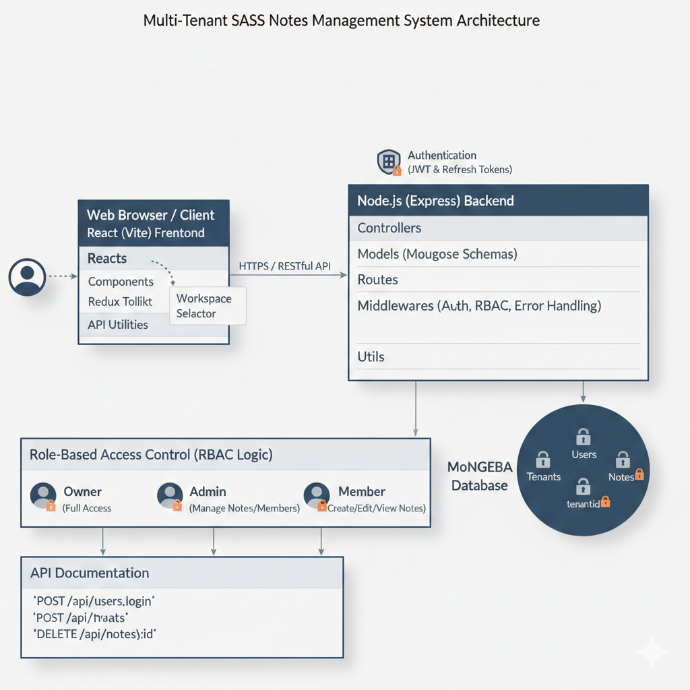

# Multi-Tenant SaaS Notes Management System
# CollabNotes
A full-stack SaaS application for managing notes with multi-tenancy and role-based access control. Built with Node.js (Express) for the backend and React (Vite) for the frontend.

---

## Table of Contents
- [Setup Instructions](#setup-instructions)
- [Architecture Overview](#architecture-overview)
- [Multi-Tenancy Approach](#multi-tenancy-approach)
- [Role-Based Authorization Logic](#role-based-authorization-logic)
- [API Documentation](#api-documentation)

---

## Setup Instructions

### Prerequisites
- Node.js (v16+ recommended)
- npm or yarn
- MongoDB (local or cloud instance)

### Backend Setup
1. Navigate to the backend folder:
   ```sh
   cd backend
   ```
2. Install dependencies:
   ```sh
   npm install
   ```
3. Create a `.env` file based on `.env.example` and set your environment variables (MongoDB URI, JWT secret, etc).
MONGO_URL=""
PORT=""
ACCESS_TOKEN_SECRET=""
REFRESH_TOKEN_SECRET=""

ACCESS_TOKEN_EXPIRY=""
REFRESH_TOKEN_EXPIRY=""
4. Start the backend server:
   ```sh
   npm start
   ```

### Frontend Setup
1. Navigate to the frontend folder:
   ```sh
   cd frontend
   ```
2. Install dependencies:
   ```sh
   npm install
   ```
3. Start the frontend development server:
   ```sh
   npm run dev
   ```
4. Open [http://localhost:5173](http://localhost:5173) in your browser for running locally 

---

## Architecture Overview

- **Backend:** Node.js, Express, MongoDB (Mongoose)
  - Organized by feature: controllers, models, routes, middlewares, utils
  - RESTful API design
- **Frontend:** React (Vite)
  - Component-based structure
  - State management with Redux Toolkit
  - API calls via a centralized `api.js`
 


**Folder Structure:**
```

## Architecture Overview


**Backend:** Node.js, Express, MongoDB (Mongoose)
  - Organized by feature: controllers, models, routes, middlewares, utils
  - RESTful API design
**Frontend:** React (Vite)
  - Component-based structure
  - State management with Redux Toolkit
  - API calls via a centralized `api.js`

**Folder Structure:**
```
backend/
  controllers/      # Business logic for each resource
  models/           # Mongoose schemas
  routes/           # API endpoints
  middlewares/      # Auth, error handling, etc.
  utils/            # Helpers and response formatting
frontend/
  src/components/   # UI components
  src/features/     # Redux slices
  src/api/          # API utilities
  src/store/        # Redux store setup
```


## Authentication Logic

- **Token-Based Authentication:**
  - Upon login, the backend issues two tokens:
    - **Access Token:**
      - Short-lived JWT used for authenticating API requests.
      - Stored in `localStorage` on the client for persistent authentication across browser sessions.
    - **Refresh Token:**
      - Longer-lived token used to obtain new access tokens when the current one expires.
      - Stored in `sessionStorage` for enhanced security (cleared when the browser/tab is closed).
  - **Flow:**
    1. User logs in and receives both tokens.
    2. Access token is sent with each API request in the `Authorization` header.
    3. When the access token expires, the frontend uses the refresh token (from `sessionStorage`) to request a new access token from the backend.
    4. If the refresh token is invalid or expired, the user is logged out and must re-authenticate.

---

## Role-Based Authorization Logic

- **Roles:**
  
  - `Admin`: Manage notes and members, but limited workspace settings
  - `Member`: Can create, edit, and view notes
- **Authorization Middleware:**
  - Checks JWT for authentication
  - Verifies user’s role within the current tenant before allowing access to protected routes
  - Example: Only Owners/Admins can invite/remove members; only Members can create notes

---

# Multi-Tenant SaaS Notes Management System

# CollabNotes

A full-stack SaaS application for managing notes with **multi-tenancy**, **strict tenant isolation**, and **role-based access control**.
Built with **Node.js (Express)** for the backend and **React (Vite)** for the frontend.

---

## Table of Contents

* Setup Instructions
* Architecture Overview
* Multi-Tenancy Approach
* Authentication & Authorization
* Role-Based Authorization Logic
* API Documentation
* Deployment

---

## Setup Instructions

### Prerequisites

* Node.js (v16+)
* npm or yarn
* MongoDB (local or cloud)

---

### Backend Setup (Local)

```bash
cd backend
npm install
npm start
```

Create a `.env` file in the backend directory with the following content:

```env
MONGO_URL=""
PORT=""
ACCESS_TOKEN_SECRET=""
REFRESH_TOKEN_SECRET=""
ACCESS_TOKEN_EXPIRY=""
REFRESH_TOKEN_EXPIRY=""
```

Backend runs at:

```
http://localhost:5000
```

---

### Frontend Setup (Local)

```bash
cd frontend
npm install
npm run dev
```

Frontend runs at:

```
http://localhost:5173
```

---

## Architecture Overview

**Backend**

* Node.js + Express
* MongoDB with Mongoose
* Feature-based structure (controllers, models, routes, middleware)
* Centralized authentication & authorization middleware

**Frontend**

* React (Vite)
* Redux Toolkit for state management
* Axios with interceptors for auth handling

> 📌 Add architecture diagram image here

---

## Multi-Tenancy Approach

* Shared database, single schema
* All tenant-owned entities include `tenantId`
* User access is resolved through tenant membership
* Every protected request:

  1. Authenticates user
  2. Resolves tenant context
  3. Enforces tenant-level isolation
* Cross-tenant access is strictly blocked

---

## Authentication & Authorization

### Token Strategy

* **Access Token**

  * Short-lived JWT
  * Sent via `Authorization: Bearer <token>`
  * Stored on client (memory / localStorage)

* **Refresh Token**

  * Long-lived token
  * Stored in **HTTP-only cookies**
  * Never exposed to JavaScript

### Flow

1. User logs in → receives access token + refresh cookie
2. Access token used for API calls
3. If access token expires → `/auth/refresh`
4. If refresh fails → redirect to login

---

## Role-Based Authorization Logic

### Roles

* **Admin**

  * Invite users
  * Upgrade subscription
  * Full note access

* **Member**

  * Create, read, update, delete notes
  * Restricted to their tenant only

Authorization is enforced via middleware on every protected route.

---

## API Documentation

### Base URLs

| Environment | Base URL                                          |
| ----------- | ------------------------------------------------- |
| Local       | `http://localhost:5000/api`                       |
| Deployed    | `https://<your-backend-service>.onrender.com/api` |

---

### Authentication Routes

```http
POST /auth/register        # Register new user
POST /auth/login           # Login user
GET  /auth/refresh-token   # Generate new access token using refresh token
```

* Access Token returned in response
* Refresh Token sent via HTTP-only cookie

---

### Tenant Routes

```http
POST   /tenant/create                     # Create new tenant
GET    /tenant/get-all                    # Get all tenants for logged-in user
DELETE /tenant/delete/:tenantId           # Delete tenant (admin only)
PATCH  /tenant/edit/subscription/:tenantId# Update tenant subscription plan
```

---

### Tenant Membership Routes

```http
GET    /tenant-membership/:tenantId           # Get all memberships for a tenant
POST   /tenant-membership/:tenantId           # Add member to tenant
PUT    /tenant-membership/role/:tenantId      # Change member role
DELETE /tenant-membership/:tenantId           # Remove member from tenant
```

All membership routes are protected using `verifyJWT` and `checkAccess` middleware.

---

### Notes Routes (Tenant Scoped)

```http
POST   /notes/create/:tenantId                 # Create note
GET    /notes/get-all/:tenantId                # Get all notes for tenant
PATCH  /notes/edit/:tenantId/:noteId           # Edit note
DELETE /notes/delete/:tenantId/:noteId         # Delete note
```

All note operations enforce tenant isolation using `tenantId`.

---

## Deployment

**Frontend (Netlify)**
[https://sprightly-gelato-6bd483.netlify.app](https://sprightly-gelato-6bd483.netlify.app)

**Backend (Render)**
https://<your-backend-service>.onrender.com

---

## Evaluation Notes


* Backend architecture prioritized
* Secure JWT handling
* Strict tenant isolation
* Clear system design explanation

---


